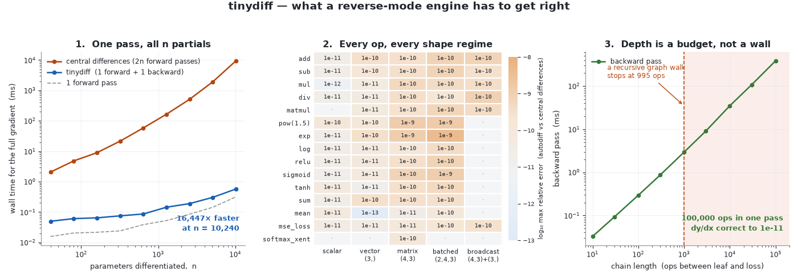
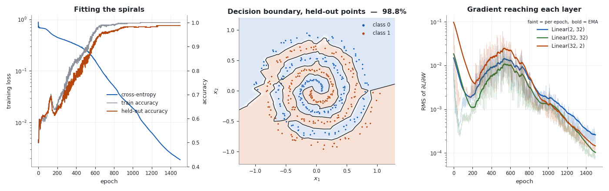

# tinydiff

[](https://github.com/superkush06/tinydiff/actions/workflows/ci.yml)

Reverse-mode automatic differentiation, written out in full.

Reverse mode is the trick that makes training affordable: run the program once,
walk the graph backwards once, and you have *every* partial derivative — all
`n` of them, for roughly the price of the forward pass. tinydiff is that trick
in about 420 lines of NumPy, including the parts that micrograd-style clones
usually wave through: broadcasting, the whole of `np.matmul`'s shape space, a
graph walk that survives a hundred thousand operations, and a `backward()` that
would rather raise than hand back a number it cannot stand behind.

Python 3.11+, NumPy, and nothing else at runtime.



Everything above is measured by `examples/make_figures.py`, which calls this
library and plots what comes back. Reading it left to right:

**1 — Cost.** The rust line is the full gradient by central differences: `2n`
forward passes, climbing with `n` for ever. The blue line is one backward
pass, and the grey dashed line is one forward pass — blue sits a small
constant above grey and *stays* there as `n` grows. At the right-hand edge
the two methods are four orders of magnitude apart and the gap is still
widening. That constant is the entire reason reverse mode exists. (The exact
ratio is a wall-clock measurement, so the script prints it and the panel
annotates it; it is not repeated here, where it could only go stale.)

**2 — Correctness.** Every public op crossed with five shape regimes, scored by
the worst relative disagreement with a central-difference estimate: 62
(op, shape) pairs, worst case `4.2e-09`. The darker cells are not autodiff
error — they are the *reference method's* error, which at `eps = 1e-6` is
`2.3e-10` at the median cell and `4.2e-09` at the worst of the 62. Dots mark
combinations that do not exist; a unary op has
nothing to broadcast against.

**3 — Depth.** Backward time is linear in graph depth across four decades, and
a 100,000-op chain returns `dy/dx` correct to `1.1e-11`. The vertical line is
measured rather than quoted: the textbook recursive graph walk raises
`RecursionError` at 995 ops on this interpreter. tinydiff's traversal uses an
explicit stack, so depth is a memory question, not a stack-frame question.

## Install

```bash
git clone https://github.com/superkush06/tinydiff.git
cd tinydiff
pip install -e ".[dev]"
pytest          # 124 tests, ~3 seconds
```

## Thirty seconds

```python
import numpy as np
import tinydiff as td

x = td.Tensor([-1.0, 0.5, 2.0], requires_grad=True)
W = td.Tensor(np.array([[1.0, 2.0], [0.0, -1.0], [3.0, 0.5]]), requires_grad=True)

loss = (td.tanh(x @ W) ** 2).sum()
loss.backward()

print("loss   ", round(float(loss.data), 6))
print("x.grad ", x.grad.round(6))
print("W.grad ", W.grad.round(6))
```

```
loss    1.819112
x.grad  [-0.653902  0.327133 -0.162477]
W.grad  [[-3.63000e-04  3.27133e-01]
 [ 1.82000e-04 -1.63566e-01]
 [ 7.26000e-04 -6.54265e-01]]
```

Note what just happened without comment: `x` is 1-D, `W` is 2-D. That is a
shape pair `np.matmul` accepts, so tinydiff differentiates it.

## What is in the box

| module | contents |
| --- | --- |
| `tensor.py` | `Tensor`, the reverse-topological walk, `_unbroadcast` |
| `ops.py` | `add sub mul div matmul pow_ neg exp log relu sigmoid tanh sum_ mean`, plus the operator overloads |
| `nn.py` | `Module`, `Linear` (Kaiming-uniform init), `Sequential` |
| `loss.py` | `mse_loss`, and a fused, max-shifted `softmax_crossentropy` |
| `optim.py` | `SGD` with momentum, `Adam` |
| `gradcheck.py` | `grad_check` — central differences, strict about missing gradients |

## Matmul, across the shape space it advertises

`a @ b` differentiates for every operand rank `np.matmul` accepts — vectors,
matrices, stacked operands, broadcast batch dimensions — and not merely for the
2-D × 2-D case a test suite reaches for first:

```python
import numpy as np
import tinydiff as td

rng = np.random.default_rng(0)
a = td.Tensor(rng.standard_normal((4, 3, 2)), requires_grad=True)  # a batch of 4
b = td.Tensor(rng.standard_normal((2, 5)), requires_grad=True)     # shared weights
v = td.Tensor(rng.standard_normal(5), requires_grad=True)          # a plain vector

out = (a @ b) @ v          # (4,3,2) @ (2,5) -> (4,3,5);  @ (5,) -> (4,3)
out.sum().backward()

print(out.shape)
print(a.grad.shape, b.grad.shape, v.grad.shape)
```

```
(4, 3)
(4, 3, 2) (2, 5) (5,)
```

1-D operands follow the `(n?,k),(k,m?)` promotion convention; batch axes are
transposed with `swapaxes(-1, -2)` rather than `.T`, which would reverse *all*
axes; broadcast batch dimensions are summed out on the way back. A randomised
30-shape sweep pushes all of it through `grad_check` on every CI run
(`tests/test_matmul.py`), and the derivation is in
[`docs/theory.md`](docs/theory.md).

## Gradients you can bet a training run on

Three rules, each of which exists because the alternative is a wrong number
rather than an exception:

```python
import tinydiff as td

x = td.Tensor(3.0, requires_grad=True)
z = 2.0 * x * x          # dz/dx = 4x = 12 at x = 3
z.backward()
print("after one pass ", x.grad)

try:
    z.backward()
except RuntimeError as err:
    print("second pass    ", err)

z.backward(retain_graph=True)
print("opted in       ", x.grad)

y = td.Tensor([1.0, 2.0], requires_grad=True)
try:
    (y * y).backward(1.0)
except ValueError as err:
    print("bad seed       ", err)
```

```
after one pass  12.0
second pass     backward() was already called through this graph; pass retain_graph=True to backpropagate again (leaf grads will accumulate)
opted in        24.0
bad seed        backward() seed shape () does not match output shape (2,)
```

1. A second pass through a used graph raises. Opting in with `retain_graph=True`
   clears interior gradients first, so leaves accumulate to 24 rather than
   compounding stale intermediates into 48.
2. An explicit seed must match the output's shape. A scalar seed on a vector
   output would broadcast happily and hand back gradients for a loss you never
   wrote.
3. `Linear` layers built without an explicit `rng` draw from one shared
   process-wide generator, so two same-shaped layers never start life
   byte-identical. Pass `rng=np.random.default_rng(seed)` when you want a run
   you can repeat; the examples all do.

## Checking your own gradients

`grad_check` takes any function of tensors that returns a scalar and compares
its autodiff gradients against central differences:

```python
import numpy as np
import tinydiff as td

def f(a, b):
    return td.mean(td.log(td.sigmoid(a @ b) + 0.5))

rng = np.random.default_rng(0)
print(td.grad_check(f, rng.standard_normal((4, 3, 2)), rng.standard_normal((2, 5))))

def forgets_b(a, b):
    return (a * a).sum()

print(td.grad_check(forgets_b, np.ones((2, 2)), np.ones((2, 2))))
```

```
True
grad missing: input 1 (shape (2, 2)) has requires_grad but received no gradient
False
```

The second case is the point. A function that never touches an input produces
no gradient for it, and a checker that quietly skips such inputs will certify
an op that forgot to write into one of its children — which is exactly the
shape of the worst bug an autodiff engine can ship.

## Checked against arithmetic done somewhere else

A test suite proves a library agrees with itself. `examples/validate.py`
compares it to things that are not it: derivatives worked out on paper,
published results for canonical functions, and an estimator that shares no
code with the engine.

```bash
PYTHONPATH=. python3 examples/validate.py   # exits non-zero if any row fails
```

| section | what it checks | result |
| --- | --- | --- |
| 1 | closed-form derivative of every op, written out by hand | 16 rows, worst relative error `1.11e-16` |
| 2 | canonical functions: Rosenbrock, logistic NLL, Euler's theorem, He's variance, Adam's first step | 16 rows, worst `2.09e-04` (a sample variance — see the doc) |
| 3 | central differences, every op crossed with every shape regime | 66 (op, shape) pairs at `tol=1e-6`, 0 failed |
| 4 | naive vs max-shifted, at the shift where the naive form stops returning a number | 14 rows |
| 5 | known disagreements, printed on purpose | `relu'(0)`, the `1e-9` resolution floor, and the second derivatives this design cannot produce at all |

Two rows worth lifting out. The Rosenbrock gradient at the conventional
starting point $(-1.2, 1)$ is $(-215.6, -88.0)$; tinydiff returns
`(-215.6000000000, -88.0000000000)`, off by `1.61e-16`. And Euler's
homogeneous function theorem — $\langle x, \nabla f(x)\rangle = k f(x)$ —
holds to one ulp for degrees 1, 2 and 3, which it can only do if every VJP
on the path *and* the fan-out accumulation are right, and which needs no
reference implementation at all.


Panel A: the naive `log(sum(exp(z)))` and the max-shifted form are
bit-identical until `c = 710`, where one of them stops returning a number.
Panel B holds the row that should worry you: at a logit gap of 745 the naive
cross-entropy does not fail, it returns `744.4401`, half a nat wrong,
because the probability it took the log of had gone subnormal. `inf` gets
noticed; a plausible number does not. Panel C is the honest note underneath
the whole exercise: the finite-difference reference bottoms out at
$3\times10^{-11}$, which is why no gradient-check tolerance below about
`1e-9` means anything, and why the closed forms in section 2 are the checks
that actually pin the last digits.

The full ledger — claim, our value, reference value, source — is in
[`docs/validation.md`](docs/validation.md), including a section on the eight
places tinydiff does *not* match its reference, and why each one is there.

`tests/test_properties.py` covers the other half: 200 randomised draws per
invariant for the statements that must hold on *every* input rather than on
a fixture — the directional derivative, linearity of the VJP, Euler
homogeneity, fan-out accumulation, broadcast conservation, the matmul
adjoint identity at every operand rank, traversal order, softmax rows
summing to zero, convexity as a monotone gradient, and Adam's scale-free
first step.

## Depth

```python
import tinydiff as td

k = 100_000
m = 2.0 ** (1.0 / k)        # so that dy/dx is exactly 2, whatever k is

x = td.Tensor(1.0, requires_grad=True)
y = x
for _ in range(k):
    y = y * m
y.backward()

print(f"{k} ops deep, dy/dx = {float(x.grad):.12f}")
```

```
100000 ops deep, dy/dx = 1.999999999979
```

The chain is built so the answer is exactly 2 at any depth, which turns the
last few digits into a running total of floating-point drift rather than a
mystery. The whole backward pass is a few hundred milliseconds of pure
Python — a couple of microseconds per node, and panel 3 has the measurement.

## Examples

```bash
PYTHONPATH=. python3 examples/xor.py            # the smallest non-linear problem
PYTHONPATH=. python3 examples/fit_sine.py       # regression, two hidden layers
PYTHONPATH=. python3 examples/spiral.py         # two spirals, with a held-out set
PYTHONPATH=. python3 examples/validate.py       # the ledger behind docs/validation.md
PYTHONPATH=. python3 examples/transformer_block.py  # autodiff as a check on hand-written backprop
PYTHONPATH=. python3 examples/make_figures.py   # regenerates docs/*.png (needs matplotlib)
```

`xor.py` — four points, no linear separator, one hidden layer of four `tanh`
units. The cheapest possible proof that the graph is wired correctly:

```
epoch    0: loss=1.4742  acc=50%
epoch  100: loss=0.0064  acc=100%
epoch  999: loss=0.0002  acc=100%
```

`fit_sine.py` — 256 points of `sin(x)` on `[-3, 3]`, a 1-32-32-1 ReLU stack,
Adam at 0.01. Mean squared error falls three orders of magnitude in 200 epochs:

```
epoch    0: loss=1.339921
epoch  100: loss=0.019545
epoch  199: loss=0.001599

final loss: 0.001599
```

`spiral.py` — two Archimedean spirals half a turn out of phase, trained on one
noise draw and scored on another:

```
epoch    0: loss=0.8808  train=50.0%  test=50.0%
epoch  500: loss=0.2527  train=88.5%  test=85.2%
epoch 1000: loss=0.0190  train=99.8%  test=98.2%
epoch 1499: loss=0.0019  train=100.0%  test=98.8%
```



Three readings. Held-out accuracy tracks training accuracy the whole way down —
100% train against 98.8% held out is a fit, not a memorisation. The middle
panel draws the *held-out* points on a region learned from the training draw;
the boundary spirals because it has to, and the mistakes are out at the rim
where the arms crowd. The gradient panel is the one worth staring at: all three
layers carry gradients of the same order throughout, so nothing vanishes on the
way back through two ReLUs, and the three-decade collapse after epoch 800 is
the network arriving, not dying.

`transformer_block.py` — one transformer feed-forward sublayer (LayerNorm →
projection → GELU → projection → residual → unembedding → cross-entropy),
built twice on the same parameters: once as hand-derived NumPy, the way you
write it when you are not using an autodiff engine, and once as tinydiff
expressions. Every gradient is compared.

```
forward loss   hand-written 3.828826741946   tinydiff 3.828826741946   gap 0.0e+00

correct hand-derived backward pass
  parameter  max rel gap       cosine
  gamma        1.72e-16   1.00000000
  W1           2.31e-16   1.00000000
  X            3.06e-16   1.00000000
  -> worst disagreement 4.8e-16; the two derivations are the same function.
```

Then it injects two mistakes of the kind that actually ship — a bias
gradient not summed over the token axis, and a LayerNorm backward that
treats `1/sigma` as a constant — and shows what they cost:

```
injected bug: b1 gradient not summed over the token axis
  one step of size 0.05 downhill: loss 3.828827 -> 2.935147   (still descends)
  b1           7.62e-01   0.52006403  <-- wrong

injected bug: LayerNorm backward missing its two mean terms
  one step of size 0.05 downhill: loss 3.828827 -> 2.924399   (still descends)
  X            5.12e-01   0.92334552  <-- wrong
```

Neither announces itself. The first keeps a cosine of `0.52` with the true
gradient — still downhill, so the training curve looks fine. The second
does not touch this block's own parameters at all: it corrupts `dL/dX`, the
gradient the block hands to the layer below, where it becomes somebody
else's slow convergence. Comparing against an engine finds both on the
first backward pass, before any training has happened.

## Theory

[`docs/theory.md`](docs/theory.md) covers why reverse mode beats forward mode
by a factor of `n`, what the topological walk has to guarantee, the three
things `np.matmul`'s gufunc signature does to a backward pass, why a numerical
gradient check cannot resolve better than about `1e-8`, and where the `6` in
`sqrt(6 / fan_in)` comes from. [`docs/validation.md`](docs/validation.md) is
where each of those claims gets checked against a source outside this
repository, with the disagreements listed rather than smoothed over.

## Limitations

Stated plainly, because they bound what you can build on this:

- **No shape ops.** There is no `reshape`, `transpose`, indexing, `concat`, or
  `max`. Dense stacks are expressible; convolutions and attention are not.
- **No higher-order gradients.** Every `_backward()` closure computes NumPy
  arrays, so the backward pass is not itself differentiable. Changing that
  means rewriting every op to compose `Tensor`s — a design change, not a flag.
- **float64 only**, on CPU, single-threaded. There is no dtype policy and no
  device concept.
- **Per-op overhead dominates for small tensors.** About 2.6 µs of Python per
  node makes this a teaching engine and a correctness reference, not a fast
  one. Panel 1 is a claim about asymptotics, not about beating a BLAS.
- **The graph retains every intermediate** until the root tensor is dropped. A
  100,000-op chain holds 100,000 live `Tensor`s.

## Where this sits

`transformer-from-scratch` is a decoder-only GPT written with no autodiff at
all: embeddings, causal attention, LayerNorm, GELU and cross-entropy, each
with a backward pass derived on paper and written out as NumPy. It is this
engine, reimplemented by hand and specialised to one architecture. That is a
defensible constraint right up to the moment a hand-derived VJP is wrong, so
`examples/transformer_block.py` above expresses one of its sublayers both
ways and diffs the gradients. `rl-gym` is the other consumer of the same
mathematics — REINFORCE and A2C are a policy gradient and nothing else.

The repos are standalone on purpose: nothing here imports either of them,
and neither imports this. What travels between them is the derivation, and
the point of this one is to be the copy that is checkable.

## License

MIT — see [LICENSE](LICENSE).
