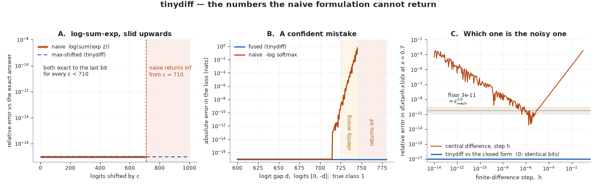

# Validation

A test suite proves that a library agrees with itself. This page is the
other thing: every claim below is checked against arithmetic that was done
somewhere else — a derivative worked out on paper, a published result, or
an estimator that shares no code with the engine.

Everything here is produced by

```bash
PYTHONPATH=. python3 examples/validate.py     # exits non-zero if any row fails
pytest tests/test_validation.py               # the same rows, as assertions
```

and the numbers in the tables are pasted from that script's output, not
retyped. The script is run on every CI build, so a row that stops being
true turns the build red instead of quietly becoming wrong.

Two conventions used throughout:

- **"hand-derived"** means the reference is a closed form written out in
  the script as plain NumPy, cited to a source where one exists and to
  nothing where the derivative is a first-year exercise. Where I could not
  confirm a published value to the digit, the reference is the analytic
  ground truth and this page says so.
- **relative error** is `max |ours - ref| / max(1, |ref|)`, so rows whose
  reference is near zero are not scored on a division by nothing.

---

## 1. Tolerances, and why those

| tolerance | value | what binds it |
| --- | --- | --- |
| closed forms | `1e-12` relative | Both sides evaluate the same real number in float64 and differ only in the order of the roundings, so the gap sits at a few ulp. Observed worst case across all rows: `1.11e-16`. 1e-12 leaves four decades of slack for a different BLAS or summation order, and is still four decades too tight to hide a wrong formula. |
| central differences | `1e-6` relative | Bounded from below by the *estimator*, not by us. Truncation error goes as $h^2 f'''/6$ and round-off as $\epsilon_{\text{mach}}\,\lvert f\rvert / h$; their sum bottoms out near $\epsilon_{\text{mach}}^{2/3} \approx 3.7\times10^{-11}$ (Nocedal & Wright 2006, §8.1). At the $h = 10^{-6}$ the checker uses, the floor is higher than that optimum, and it is measured rather than inferred: across the 62 (op, shape) cells of §4 the disagreement runs `2.99e-13` to `4.23e-09`, median `2.29e-10`. `1e-6` therefore sits about 240× above the noisiest cell and about 4000× above the median one, and orders of magnitude below any genuinely wrong VJP, which is off by a *factor*, not a rounding. |

The floor is measured rather than assumed — panel C of the figure below,
and `tests/test_validation.py::test_central_difference_floor_is_near_eps_two_thirds`.

## 2. Closed-form derivatives, op by op

Every op but the two reductions is wrapped in a weighted sum with a fixed
random weight matrix, so the incoming gradient is that matrix rather than a
vector of ones; a VJP that ignores its upstream gradient passes a
`sum()`-only check and fails this one. `sum_` and `mean` are the exception —
wrapping a reduction in another reduction tests the wrapper — so those two
rows are seeded with ones. `mean` still bites, because it reaches `sum_`
through a $1/N$ scale: replacing `out.grad` with ones inside `sum_` leaves
the `sum_` row's numbers untouched, turns the `mean` and `mse_loss` rows
below and both logistic rows in §3 red, and fails twelve tests across the
suite. Only the `sum_` row itself is blind to that bug class.
The reported figure is the largest entry of the gradient, which
is enough to see the two derivations landed in the same place, with the
relative error over the whole array beside it.

| claim | our value | reference value | relative error | source |
| --- | --- | --- | --- | --- |
| `d(-x) = -1` | `max\|g\| = 1.539301` | `1.539301` | `0.00e+00` | hand-derived |
| `d(e^x) = e^x` | `3.282747` | `3.282747` | `0.00e+00` | hand-derived |
| `d(ln x) = 1/x` | `1.403827` | `1.403827` | `0.00e+00` | hand-derived |
| `d(x^1.5) = 1.5 x^0.5` | `3.124887` | `3.124887` | `0.00e+00` | hand-derived |
| `d(max(0,x)) = 1[x>0]` | `1.539301` | `1.539301` | `0.00e+00` | hand-derived (see §7 for `x = 0`) |
| `d(sigmoid) = s(1-s)` | `0.341452` | `0.341452` | `0.00e+00` | hand-derived |
| `d(tanh) = 1 - tanh^2` | `0.978798` | `0.978798` | `0.00e+00` | hand-derived |
| `d(sum x) = 1` | `1.000000` | `1.000000` | `0.00e+00` | hand-derived |
| `d(mean x) = 1/N` | `0.083333` | `0.083333` | `0.00e+00` | hand-derived |
| `d(x+y)`, `d(x-y)` | `1.539301` | `1.539301` | `0.00e+00` | hand-derived |
| `d(x*y)/dx = y` | `3.334403` | `3.334403` | `0.00e+00` | hand-derived |
| `d(x/y)/dx = 1/y` | `0.710607` | `0.710607` | `0.00e+00` | hand-derived |
| matmul: $\bar A = \bar C B^\top$, $\bar B = A^\top \bar C$ | `max\|dA\| = 2.527456` | `2.527456` | `0.00e+00` | Giles (2008) |
| `d(mse)/dp = 2(p-t)/N` | `0.508573` | `0.508573` | `1.11e-16` | hand-derived |
| `d(softmax-CE)/dz = (p - onehot)/N` | `0.188248` | `0.188248` | `0.00e+00` | Bishop (2006), §4.3.4 |

Fifteen lines above; the script reports sixteen rows, because it checks
`add` and `sub` separately. Worst relative error `1.11e-16` — one ulp.

## 3. Canonical functions

| claim | our value | reference value | relative error | source |
| --- | --- | --- | --- | --- |
| Rosenbrock $\nabla f$ at the standard start $(-1.2, 1)$ | `(-215.6000000000, -88.0000000000)` | `(-215.6, -88.0)` | `1.61e-16` | Rosenbrock (1960) for the function and the start point; gradient hand-derived |
| Rosenbrock $f(-1.2, 1)$ | `24.2000000000` | `24.2` | `1.47e-16` | as above |
| Rosenbrock $\nabla f$ at the minimum $(1, 1)$ | `(0.0e+00, 0.0e+00)` | `(0, 0)` | `0.00e+00` | exactly zero, not approximately |
| logistic NLL gradient $= X^\top(\sigma(Xw) - t)/N$ | `max\|g\| = 0.316178782` | `0.316178782` | `2.78e-17` | Bishop (2006), §4.3.2 |
| logistic NLL gradient is a monotone operator over 500 random pairs | `min <Δg, Δw> = 7.93e-02` | `≥ 0` | — | convexity of logistic regression; see §6 |
| cross-entropy on uniform logits $= \log C$, $C = 2$ | `0.693147180559945` | `0.693147180559945` | `0.00e+00` | analytic |
| ... $C = 7$ | `1.945910149055313` | `1.945910149055313` | `0.00e+00` | analytic |
| ... $C = 64$ | `4.158883083359671` | `4.158883083359671` | `0.00e+00` | analytic |
| Euler identity $\langle x, \nabla f\rangle = k f$, $k = 3$ | `-34.6422567334` | `-34.6422567334` | `2.05e-16` | Euler's homogeneous function theorem |
| ... $k = 2$ | `27.2609595096` | `27.2609595096` | `0.00e+00` | as above |
| ... $k = 1$ (ReLU) | `6.7437337286` | `6.7437337286` | `0.00e+00` | as above |
| `Linear` init: $\operatorname{Var}[W] = 2/\text{fan\_in}$ | `0.00195353` | `0.00195312` | `2.09e-04` | He et al. (2015), §2.2 — see §7 for the gap |
| ... and not $2/(\text{fan\_in} + \text{fan\_out})$ | `ratio 2.0004` | `ratio 2.0` | `2.09e-04` | Glorot & Bengio (2010) |
| Adam's first step, $\lvert g\rvert = 10^6$ | `-0.010000000000` | `-0.010000000000` | `1.73e-18` | Kingma & Ba (2015), Algorithm 1 |
| ... $\lvert g\rvert = 1$ | `-0.009999999900` | `-0.009999999900` | `0.00e+00` | as above |
| ... $\lvert g\rvert = 10^{-3}$ | `-0.009999900001` | `-0.009999900001` | `0.00e+00` | as above |

Two of these deserve a sentence.

**Euler's theorem** is the row I would keep if I could keep only one. For a
function homogeneous of degree $k$, $\langle x, \nabla f(x)\rangle = k f(x)$
identically. Nothing in the engine knows this; it comes out right only if
every VJP on the path is right *and* fan-out accumulation is right, and it
needs no reference implementation to check against — just the function's
own value.

**Adam's first step** is a closed form worth pinning because it is Adam's
selling point: at $t = 1$ the bias correction makes $\hat m = g$ and
$\hat v = g^2$ exactly, so the update collapses to
$-\alpha\, g / (\lvert g\rvert + \epsilon)$ — the same size whether the
gradient is $10^6$ or $10^{-3}$. The visible drift in the third row is the
$\epsilon = 10^{-8}$ term, which is doing exactly what it is there for.

## 4. Every op, every shape regime, against central differences

`grad_check` perturbs each scalar entry by $\pm 10^{-6}$ and compares the
central difference to the autodiff gradient. It shares no code with the
backward passes it is checking.

```
neg          scalar:ok  vector:ok  matrix:ok  batched:ok
exp          scalar:ok  vector:ok  matrix:ok  batched:ok
log          scalar:ok  vector:ok  matrix:ok  batched:ok
pow_(1.5)    scalar:ok  vector:ok  matrix:ok  batched:ok
relu         scalar:ok  vector:ok  matrix:ok  batched:ok
sigmoid      scalar:ok  vector:ok  matrix:ok  batched:ok
tanh         scalar:ok  vector:ok  matrix:ok  batched:ok
sum_         scalar:ok  vector:ok  matrix:ok  batched:ok
mean         scalar:ok  vector:ok  matrix:ok  batched:ok
add          scalar:ok  vector:ok  matrix:ok  batched:ok  broadcast:ok
sub          scalar:ok  vector:ok  matrix:ok  batched:ok  broadcast:ok
mul          scalar:ok  vector:ok  matrix:ok  batched:ok  broadcast:ok
div          scalar:ok  vector:ok  matrix:ok  batched:ok  broadcast:ok
mse_loss     scalar:ok  vector:ok  matrix:ok  batched:ok  broadcast:ok
matmul       vector:ok  matrix:ok  batched:ok  broadcast:ok
softmax_xent matrix:ok

66 (op, shape) pairs checked at tol=1e-06; 0 failed
```

The companion view is panel 2 of [`engine_report.png`](engine_report.png),
which reports the *magnitude* of each disagreement rather than a pass mark:
62 cells, worst `4.2e-09`, all of it the estimator's noise.

## 5. Numerical stability



float64 stops representing $e^x$ at $x = 709.78$. Everything below is that
one fact, arriving in three different disguises.

### Log-sum-exp

The exact answer for logits $[c, c-1, c-2]$ is $c + 0.407605964444$ for
every $c$, so no reference implementation is needed.

```
c=       0  naive=        0.407605964444   shifted=        0.407605964444   ok
c=     100  naive=      100.407605964444   shifted=      100.407605964444   ok
c=     709  naive=      709.407605964444   shifted=      709.407605964444   ok
c=     710  naive=                   inf   shifted=      710.407605964444   ok
c=   10000  naive=                   inf   shifted=    10000.407605964445   ok
```

The two formulations are bit-identical up to $c = 709$ and then one of them
stops returning a number. The shift
$\operatorname{LSE}(z) = \max z + \log \sum e^{z - \max z}$
is algebraically the same expression and never evaluates $e^x$ above 1
(Blanchard, Higham & Higham 2021).

### Fused softmax cross-entropy

Cross-entropy is invariant to adding a constant to a whole row of logits,
so the correct answer at every shift is the answer at shift zero —
`1.275722181154` — and likewise for the gradient.

```
c=       0  naive=  1.275722   fused=1.275722181154   grad rel=0.0e+00   (budget 2e-15)   ok
c=     100  naive=  1.275722   fused=1.275722181154   grad rel=5.1e-16   (budget 2e-13)   ok
c=     709  naive=       nan   fused=1.275722181154   grad rel=1.4e-15   (budget 1e-12)   ok
c=     710  naive=       nan   fused=1.275722181154   grad rel=1.4e-15   (budget 1e-12)   ok
c=   10000  naive=       nan   fused=1.275722181154   grad rel=5.7e-14   (budget 2e-11)   ok
```

`nan`, not `inf`: the naive route computes $e^{z}/\sum e^{z}$, and once
both are `inf` the quotient is undefined. The gradient budget is
$8\,\epsilon_{\text{mach}}\,c$ rather than a constant, because adding
$c = 10^4$ to a logit of order 1 discards about 13 bits *before the op is
called*. That residual is the input's, not the op's — see §7.

### A confident mistake

Logits $[0, -d]$ with the true class second. The exact loss is
$d + \log(1 + e^{-d})$.

```
d=    50  naive=   50.0000   fused=   50.000000   exact=   50.000000   ok
d=   400  naive=  400.0000   fused=  400.000000   exact=  400.000000   ok
d=   745  naive=  744.4401   fused=  745.000000   exact=  745.000000   ok
d=   800  naive=       inf   fused=  800.000000   exact=  800.000000   ok
```

The row at $d = 745$ is the one that should worry you. The naive route does
not fail there — it returns `744.4401`, a number more than half a nat wrong,
because the probability it took the log of had gone subnormal. `inf` gets
noticed. A plausible-looking loss does not. Panel B of the figure above
sweeps that boundary: silently wrong from $d \approx 725$, `inf` from
$d \approx 745.5$.

## 6. What the property tests add

`tests/test_properties.py` asserts statements that must hold for *all*
valid inputs, on inputs nobody chose — 200 draws each from a seeded
generator, split evenly across the cases where a test carries several
(Euler's theorem runs four functions, the matmul adjoint seven shape
pairs). They are listed here because several of them are the only
check on a property no fixture covers:

| invariant | why it must hold |
| --- | --- |
| $\langle \nabla f(x), v\rangle$ equals the directional derivative along $v$ | the definition of the gradient; a single mis-derived VJP fails it for almost every random $v$ |
| `backward(c·g)` returns `c·backward(g)` | the backward pass is a linear map; an op that ignores its upstream gradient passes every `sum()`-only test and fails this |
| $\nabla(f+g) = \nabla f + \nabla g$ | linearity of differentiation |
| $\langle x, \nabla f(x)\rangle = k f(x)$ for homogeneous $f$ | Euler's theorem — see §3 |
| $\nabla_x \operatorname{relu}(cx)$ scales with $c$ | ReLU's only structure is positive homogeneity |
| a tensor used $k$ times receives all $k$ contributions | overwriting instead of accumulating is invisible in any graph that happens to be a tree |
| broadcast gradients conserve total mass | the adjoint of a copy is a sum: nothing created, nothing lost |
| $\langle G, AV\rangle = \langle A^\top G, V\rangle$ for every operand rank | the defining property of a reverse-mode rule, stated rank-agnostically so one assertion covers vectors, matrices, stacks and broadcast batch dims |
| children precede parents in the traversal | what makes "a node's gradient is complete when its closure runs" true |
| $k$ passes with `retain_graph=True` give exactly $k\times$ one pass | if interior gradients survived a pass, the growth would be super-linear |
| each row of $\partial L/\partial z$ sums to zero | the simplex constraint, as a gradient identity |
| shifting a row of logits changes neither loss nor gradient | tested at shifts large enough that a naive $e^z$ is `inf` |
| $0 \le L \le \log C$ when the argmax logit is the label | properties of the softmax simplex — see §7 for the float64 caveat |
| $\langle \nabla f(a) - \nabla f(b), a - b\rangle \ge 0$ for the logistic NLL | equivalent to a PSD Hessian everywhere, i.e. convexity, checked through first derivatives only because tinydiff cannot form a Hessian at all |
| $f(x - t\nabla f) < f(x)$ for small $t$ | a sign error in one VJP survives every symmetric check and fails this on the first draw |
| Adam's first step is scale-free | see §3 |
| MSE is zero exactly when prediction equals target, with a vanishing gradient | — |

## 7. Where tinydiff does not match the reference

This section exists because a validation page that claims perfection is
worth less than one that does not.

**`relu'(0)` is `0`; a central difference says `0.5`.** ReLU is not
differentiable at zero, so there is no correct answer, only a convention.
tinydiff returns the subgradient `0`, which is what PyTorch returns; the
symmetric difference quotient returns `0.5`, which is what the definition
of a symmetric difference quotient returns. Neither is wrong. It is listed
because a reader running `grad_check` on `relu` at exactly zero deserves to
know before, not after.

**There are no second derivatives at all.** $d^2(x^3)/dx^2 = 12$ at $x=2$;
tinydiff returns nothing, because `x.grad` is a NumPy array rather than a
`Tensor` and the backward pass is therefore not itself differentiable. This
is a design consequence, not a bug, and it is the single largest gap between
this engine and JAX or PyTorch. Changing it means rewriting every op's
backward to compose `Tensor`s.

**The gradient check cannot resolve better than about `1e-9`.** Section 4
says "0 failed at `tol=1e-6`", and that is all it says: agreement at a
resolution the estimator itself sets. A VJP wrong by $10^{-10}$ relative
would pass. That is why §2 exists — closed forms have no floor, and there
the agreement is one ulp.

**The Kaiming variance agrees to `2.09e-04`, not exactly.** It is a sample
variance over $1024 \times 1024$ uniform draws, and the expected relative
spread of such an estimate is
$\sqrt{(\kappa - 1)/n} \approx 8.7\times 10^{-4}$
for the uniform distribution's kurtosis. `2.09e-04` is comfortably
inside the finite-sample noise. What the row is really asking is whether the
variance is He's $2/\text{fan\_in}$ or Glorot's
$2/(\text{fan\_in} + \text{fan\_out})$, which differ by exactly a factor of
two at the square layer used here — so the tolerance is set at 1%, wide
enough for the sampling noise and nowhere near wide enough to confuse the
two constants.

**Cross-entropy loses accuracy under extreme logit shifts, and the loss
does not.** At $c = 10^4$ the gradient's relative error is `5.7e-14`
rather than zero. This is not the fused op degrading: adding $10^4$ to a
logit of order 1 rounds the *input* to a slightly different problem, and
`5.7e-14` is within the $8\epsilon_{\text{mach}}c \approx 2\times10^{-11}$
that input rounding allows. Chasing it to zero would require the caller not
to have shifted the logits.

**Cross-entropy can return exactly `0.0` in float64.** Mathematically
$L > 0$ always. Once the winning logit leads by more than
$\log(1/\epsilon_{\text{mach}}) \approx 36$ nats, $p_y$ rounds to `1.0` and
$-\log p_y$ is exactly zero. The property test asserts the weak bound
$L \ge 0$ and separately pins the margin at which equality becomes
representable, rather than pretending the strict inequality survives.

**`sigmoid` warns spuriously.** `sigmoid(-800)` computes
`1/(1 + exp(800))`, and NumPy raises `RuntimeWarning: overflow encountered
in exp` on the way to the correct answer `0.0` with the correct gradient
`0.0`. The value is right, the warning is noise, and the fix (branching on
the sign, as `scipy.special.expit` does) is not in the library today.

**Panel 1 of the engine report is one machine's wall clock.** The
asymptotic claim — reverse mode costs a constant multiple of the forward
pass while finite differences cost $O(n)$ — is a theorem (Griewank &
Walther 2008, ch. 4). The particular ratio is a measurement, and it will be
a different number on your machine. The script prints the number it
measured; the figure annotates the same number; neither is quoted anywhere
as a property of the library.

## References

- Baydin, A. G., Pearlmutter, B. A., Radul, A. A. & Siskind, J. M. (2018).
  *Automatic Differentiation in Machine Learning: a Survey*. JMLR 18(153).
  Background for §1's forward-vs-reverse framing.
- Bishop, C. M. (2006). *Pattern Recognition and Machine Learning*,
  Springer. §4.3.2 for the two-class logistic gradient
  $X^\top(\sigma(Xw) - t)$; §4.3.4 for the multiclass form $p - t$.
- Blanchard, P., Higham, D. J. & Higham, N. J. (2021). *Accurately
  computing the log-sum-exp and softmax functions*. IMA Journal of
  Numerical Analysis 41(4). The max-shift formulation used in §5 and its
  error analysis.
- Giles, M. B. (2008). *Collected Matrix Derivative Results for Forward and
  Reverse Mode Algorithmic Differentiation*. In Bischof et al. (eds),
  *Advances in Automatic Differentiation*, Springer. The matmul VJP pair
  $\bar A = \bar C B^\top$, $\bar B = A^\top \bar C$ in §2.
- Glorot, X. & Bengio, Y. (2010). *Understanding the difficulty of training
  deep feedforward neural networks*. AISTATS. The
  $2/(\text{fan\_in} + \text{fan\_out})$ variance that §3 rules out.
- Griewank, A. & Walther, A. (2008). *Evaluating Derivatives: Principles
  and Techniques of Algorithmic Differentiation*, 2nd ed., SIAM. Chapter 4
  for the cheap-gradient bound cited in §7.
- He, K., Zhang, X., Ren, S. & Sun, J. (2015). *Delving Deep into
  Rectifiers*. ICCV. §2.2 for $\operatorname{Var}[w] = 2/\text{fan\_in}$.
- Kingma, D. P. & Ba, J. (2015). *Adam: A Method for Stochastic
  Optimization*. ICLR. Algorithm 1 for the bias correction validated in §3.
- Nocedal, J. & Wright, S. J. (2006). *Numerical Optimization*, 2nd ed.,
  Springer. §8.1 for the central-difference error model and the
  $\epsilon_{\text{mach}}^{2/3}$ floor.
- Rosenbrock, H. H. (1960). *An automatic method for finding the greatest
  or least value of a function*. The Computer Journal 3(3), 175–184. The
  test function and its conventional starting point $(-1.2, 1)$.
